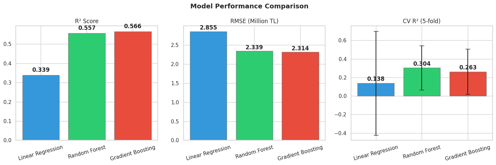
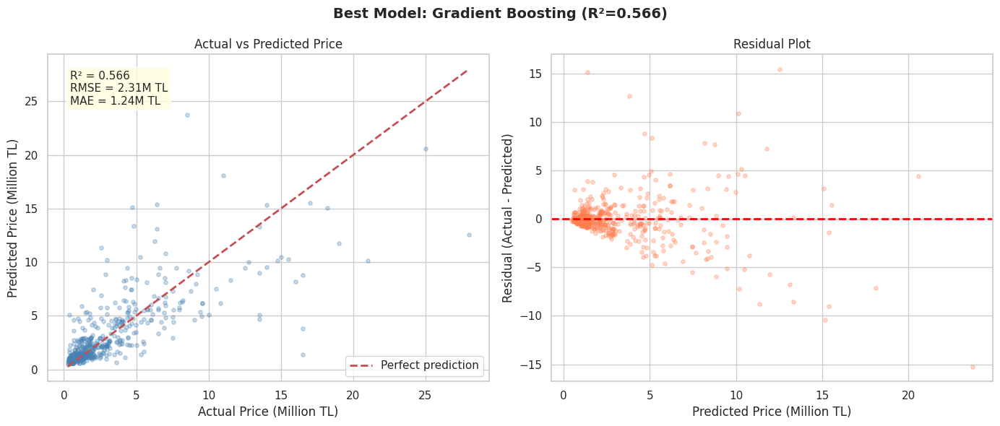
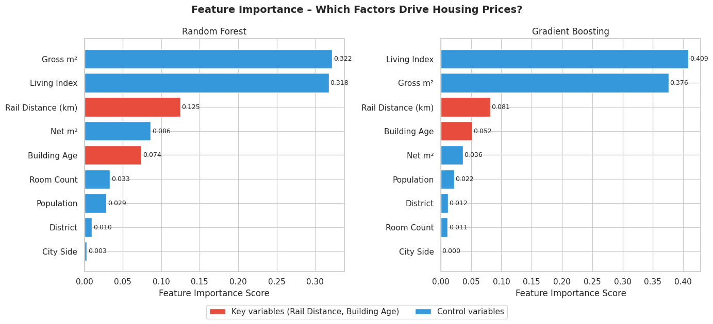

# Istanbul Housing Prices: The Effect of Building Age and Rail System Proximity

## **DSA 210 – Introduction to Data Science (Spring 2026)**

---

## Motivation

Istanbul is one of the most dynamic real estate markets in the world, with prices varying dramatically across neighborhoods. Two structural factors are particularly relevant in the Istanbul context: **building age**, given the city's seismic risk and aging housing stock, and **proximity to public rail transportation**, given chronic traffic congestion that makes metro and tram access a key quality-of-life factor.

This project investigates how these two factors influence residential sale prices, and which one carries more weight when other variables are controlled for.

---

## Data Source

The primary dataset is the **Real Estate in Istanbul (Emlakjet)** dataset from Kaggle, containing 2,983 residential listings scraped from Emlakjet.com across 13 districts of Istanbul.

- **Source:** [Kaggle – Real Estate in Istanbul / Turkey (Emlakjet)](https://www.kaggle.com/datasets/egeakyol/real-estate-in-istanbul-turkey-emlakjet)
- **Coverage:** 13 Istanbul districts, 2021–2022 listings
- **Size:** 2,983 listings, 27 original columns

To enrich the dataset, Istanbul metro, metrobus, tram, and Marmaray station coordinates were collected from the **IBB Open Data Portal**. Each of the 230 unique neighborhoods was geocoded using the **Nominatim / OpenStreetMap API**, and the **Haversine formula** was used to compute the straight-line distance from each listing to the nearest rail station.

| Dataset | Variable(s) | Purpose |
|---------|------------|---------|
| Emlakjet (Kaggle) | Price, building age, district, neighborhood, size, rooms | Primary housing data |
| IBB Open Data | Rail station coordinates (metro, tram, Marmaray, banliyö) | Enrichment: rail proximity |
| Nominatim (OSM) | Neighborhood geocoding (lat/lon) | Enrichment: spatial coordinates |

### Data Characteristics

- **Total listings:** 2,983 (after enrichment: 34 columns)
- **Neighborhoods geocoded:** 229/230 (99.6% success rate)
- **Outlier removal:** Listings with price in top/bottom 1% flagged
- **Analysis sample:** 2,923 listings after removing top 2% price outliers
- **New features added:** `Bina_Yasi_Sayi`, `Oda_Sayi_Num`, `mahalle_lat`, `mahalle_lon`, `rayli_mesafe_km`, `mesafe_band`

---

## Research Questions

### Main Question
Do building age and distance to rail systems have a statistically significant effect on residential housing prices in Istanbul, and which factor has greater predictive power?

### Sub-Questions
1. Do housing prices differ significantly across building age groups?
2. Does distance to the nearest rail station affect housing prices?
3. Is there a significant price difference between the European and Anatolian sides?
4. Which factor — building age or rail proximity — has greater predictive power for price?

---

## Hypotheses

| # | Hypothesis | H₀ | Test Method |
|---|-----------|-----|-------------|
| **H1** | Building age groups show significantly different price distributions | No difference across age groups | One-way ANOVA |
| **H2a** | Distance bands show significantly different price distributions | No difference across distance bands | One-way ANOVA |
| **H2b** | Listings near rail (<1km) are priced differently from those far away (≥1km) | No difference in mean price | Independent samples t-test |
| **H3** | European and Anatolian sides show significantly different prices | No difference in mean price | Independent samples t-test |

---

## Exploratory Data Analysis

### Price Overview and District Distribution

*Left: Price distribution after removing top 2% outliers. Median price is ~3M TL. Right: Median price by district — Beşiktaş and Sarıyer lead on the European side, while Kadıköy leads on the Anatolian side.*

### Building Age and Rail Distance Distributions

*Left: Price distribution by building age group — newer buildings show higher median prices. Right: Price distribution by distance band — listings within 500m of a rail station command notably higher prices.*

---

## Hypothesis Testing Results

### H1: Building Age and Price (ANOVA)

*ANOVA test comparing price distributions across 9 building age groups. F=2.123, p=0.031 — significant at α=0.05.*

### H2: Rail Distance and Price

*Left: ANOVA across 6 distance bands (F=27.18, p≈0.000). Right: T-test comparing listings within 1km vs beyond 1km from a rail station (t=8.127, p≈0.000).*

### H3: European vs Anatolian Side + Correlation Matrix

*Left: Price comparison by city side — no significant difference after outlier removal. Right: Correlation matrix of key numeric variables.*

### Summary of All Hypothesis Tests


| Hypothesis | Test | Statistic | p-value | Result |
|-----------|------|-----------|---------|--------|
| **H1:** Building age → price difference | ANOVA | F=2.123 | p=0.031 | ✅ Significant |
| **H2a:** Distance bands → price difference | ANOVA | F=27.18 | p≈0.000 | ✅ Significant |
| **H2b:** Near (<1km) vs Far (≥1km) | T-Test | t=8.127 | p≈0.000 | ✅ Significant |
| **H3:** European vs Anatolian side | T-Test | t=1.207 | p=0.228 | ❌ Not significant |

**Overall: 3/4 hypotheses confirmed at α=0.05**

---

## Machine Learning

Three regression models were trained to predict housing prices and quantify the relative importance of each feature — directly answering the main research question: **which factor matters more, building age or rail proximity?**

### Models Trained

| Model | Role |
|-------|------|
| Linear Regression | Baseline — simple linear model |
| Random Forest | Ensemble — robust to overfitting |
| Gradient Boosting | Best performer — sequential boosting |

### Features Used

| Feature | Type | Description |
|---------|------|-------------|
| `rayli_mesafe_km` | 🔴 Key variable | Distance to nearest rail station (km) |
| `Bina_Yasi_Sayi` | 🔴 Key variable | Building age (numeric, 0–25) |
| `Brüt_Metrekare` | 🔵 Control | Gross square meters |
| `Net_Metrekare` | 🔵 Control | Net square meters |
| `Yaşam_endeksi` | 🔵 Control | Neighborhood living quality index |
| `Nüfus` | 🔵 Control | District population |
| `ilce_enc` | 🔵 Control | District (label encoded) |
| `yaka_enc` | 🔵 Control | City side — European/Anatolian (encoded) |
| `Oda_Sayi_Num` | 🔵 Control | Number of rooms (numeric) |

Control variables are included to isolate the effect of the key variables. Without them, observed price differences could be driven by confounding factors (e.g., larger apartments near metro stations).

### Model Performance


*Left: R² scores — Gradient Boosting (0.566) outperforms Random Forest (0.557) and Linear Regression (0.339). Middle: RMSE in million TL. Right: 5-fold cross-validation R² with standard deviation — note high variance in Linear Regression, indicating instability.*

| Model | R² (Test) | RMSE | MAE | CV R² (5-fold) |
|-------|-----------|------|-----|----------------|
| Linear Regression | 0.339 | 2.86M TL | — | 0.138 ± 0.56 |
| Random Forest | 0.557 | 2.34M TL | — | 0.304 ± 0.24 |
| **Gradient Boosting** | **0.566** | **2.31M TL** | **1.24M TL** | **0.263 ± 0.25** |

**Best model: Gradient Boosting** with R²=0.567, explaining 56.7% of price variance.

### Actual vs Predicted Prices


*Left: Predicted vs actual prices for the best model (Gradient Boosting). The model performs well for mid-range properties (1–6M TL) but tends to underestimate high-end listings. Right: Residual plot — residuals are concentrated around zero for lower prices but fan out for higher predicted values, indicating heteroscedasticity typical of real estate data.*

### Feature Importance — Answering the Main Question


*Both Random Forest and Gradient Boosting consistently rank Rail Distance above Building Age. Red bars = key project variables.*

| Feature | Random Forest | Gradient Boosting |
|---------|:---:|:---:|
| Gross m² | 32.2% | 37.6% |
| Living Index | 31.9% | 40.9% |
| **Rail Distance (km)** | **12.5%** | **8.1%** |
| Net m² | 8.6% | 3.6% |
| **Building Age** | **7.4%** | **5.2%** |
| Room Count | 3.3% | 1.1% |
| Population | 2.7% | 2.2% |
| District | 1.0% | 1.2% |
| City Side | 0.3% | 0.0% |

**Answer to the main research question:** Rail proximity (~12.5%) is a stronger predictor of housing price than building age (~7.4%), consistently across both models. Rail distance carries approximately **1.7× more predictive weight** than building age.

---

## Key Findings

1. **Rail proximity has a strong and significant effect on housing prices.** Both the ANOVA across distance bands (p≈0.000) and the t-test (p≈0.000) confirm that listings closer to rail stations command significantly higher prices.

2. **Building age has a statistically significant but modest effect.** The ANOVA (F=2.123, p=0.031) confirms real price differences across building age groups, but the effect size is smaller than rail proximity (r=0.024 vs r=-0.159).

3. **Rail distance is a stronger predictor than building age**, confirmed by feature importance from both ML models (~12.5% vs ~7.4%).

4. **Gross square meters and living quality index are the dominant price drivers** at ~32% each, consistent with general housing market literature.

5. **Gradient Boosting is the best model** with R²=0.567 and RMSE=2.31M TL, explaining 56.7% of price variance.

6. **No significant European/Anatolian price difference** after outlier removal (p=0.228).

---

## Limitations and Future Work

### Limitations
- **Neighborhood-level geocoding:** Coordinates represent neighborhood centroids, not individual listing locations — listings in the same neighborhood share identical rail distances.
- **One neighborhood not geocoded:** Sahrayıcedit could not be resolved by Nominatim (7 listings affected).
- **Cross-sectional data:** Dataset covers 2021–2022 only; temporal price dynamics cannot be analyzed.
- **Dataset coverage:** Only 13 of Istanbul's 39 districts are represented, with heavy concentration in central/premium areas.
- **High CV variance** in cross-validation scores indicates model sensitivity to train/test split — a larger and more geographically diverse dataset would improve stability.

### Future Work
- Obtain listing-level coordinates for precise distance calculation
- Extend dataset to cover all 39 Istanbul districts
- Add additional enrichment: school proximity, earthquake risk scores, green space coverage
- Try XGBoost, LightGBM, and neural network models
- Incorporate temporal data to study price trends over time

---

## Project Structure

```
DSA210-Istanbul-Housing/
├── data/
│   ├── Real Estate in ISTANBUL (Emlakjet).csv     # Original dataset
│   └── istanbul_housing_enriched.csv              # Enriched dataset (34 columns)
├── figures/
│   ├── eda_overview-2.png
│   ├── eda_distributions.png
│   ├── h1_building_age.png
│   ├── h2_rail_distance.png
│   ├── h3_side_comparison.png
│   ├── hypothesis_summary.png
│   ├── ml_model_comparison.png
│   ├── ml_actual_vs_predicted.png
│   └── ml_feature_importance.png
├── notebooks/
│   └── notebookbfb756d75f.ipynb                   # Kaggle notebook
└── README.md
```

> **Note:** The notebook is designed to run on Kaggle due to the geocoding step requiring internet access and the Nominatim API. The enriched dataset (`istanbul_housing_enriched.csv`) is included in the `data/` folder and can be used directly for EDA, hypothesis testing, and ML without re-running the geocoding step.

---

## Notebook

The full analysis — data loading, cleaning, enrichment, EDA, hypothesis testing, and machine learning — was conducted in a single Kaggle notebook:

🔗 **[DSA210 Analysis Notebook – Kaggle](notebookbfb756d75f.ipynb)**

---

## AI Assistance Disclosure

AI tools (Claude) were used for:
- Data cleaning and enrichment pipeline development
- Geocoding and Haversine distance computation code
- Statistical test selection and implementation
- ML model training and feature importance analysis
- Visualization code and README structure

All research question formulation, hypothesis design, data source selection, methodology decisions, and interpretation of results were performed independently.
