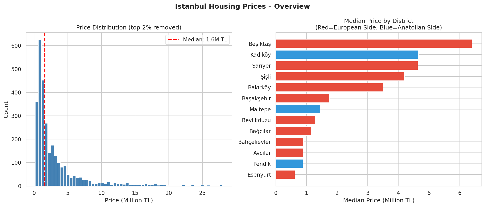
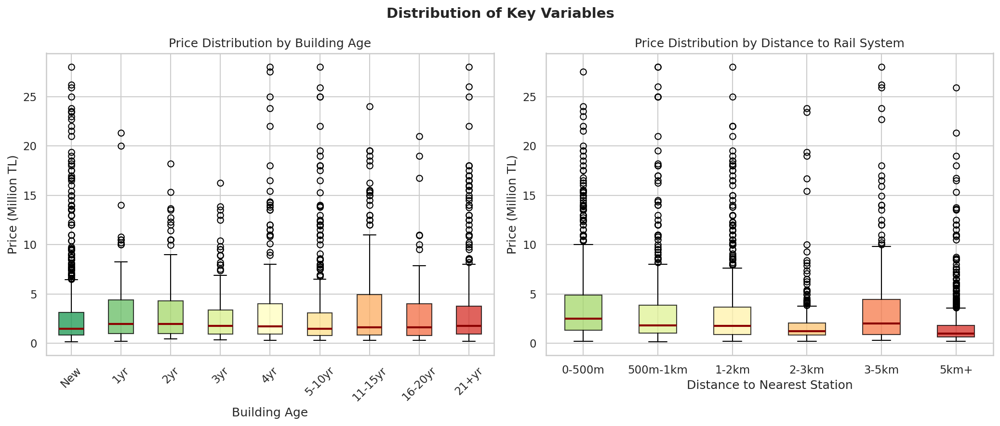
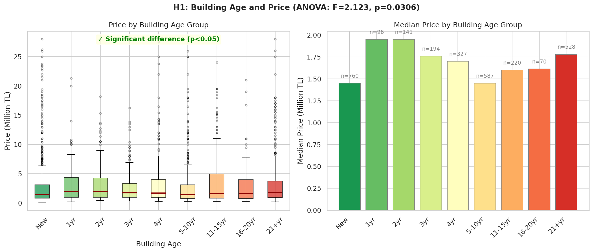
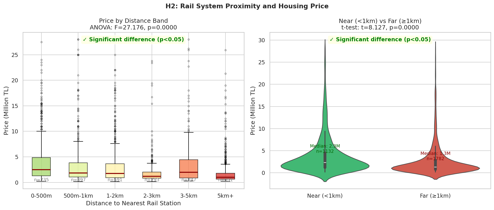
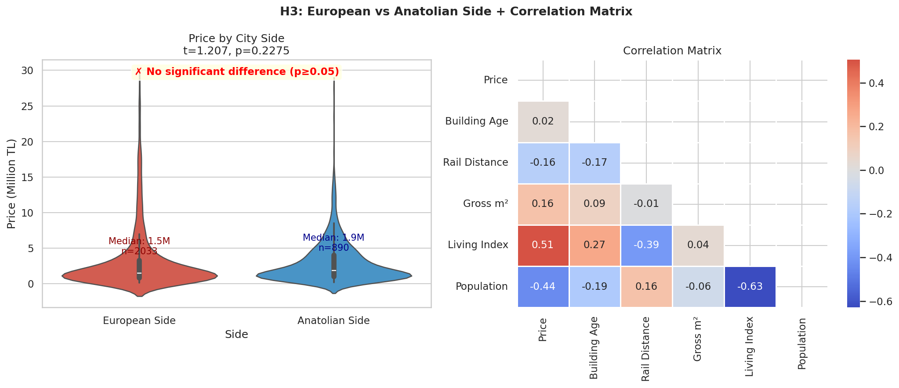
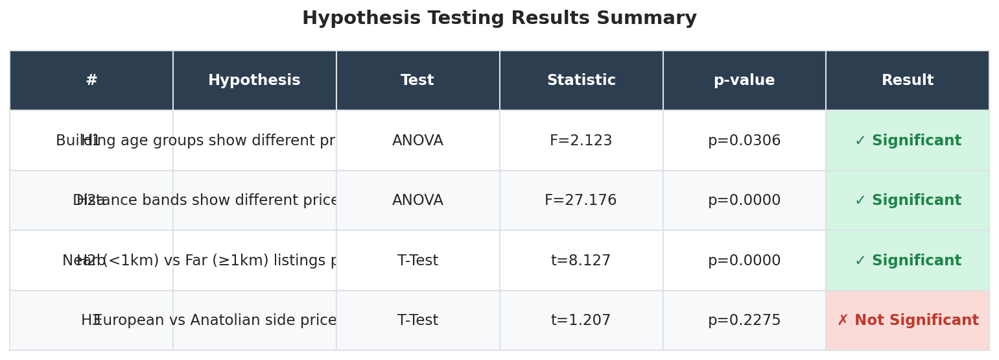

# Istanbul Housing Prices: The Effect of Building Age and Rail System Proximity

## **DSA 210 – Introduction to Data Science (Spring 2026)**

---

## Motivation

Istanbul is one of the most dynamic real estate markets in the world, with prices varying dramatically across neighborhoods. Two structural factors are particularly relevant in the Istanbul context: **building age**, given the city's seismic risk and aging housing stock, and **proximity to public rail transportation**, given chronic traffic congestion that makes metro and tram access a key quality-of-life factor.

This project investigates how these two factors influence residential sale prices, and which one carries more weight when other variables are controlled for.

---

## Data Source

The primary dataset is the **Real Estate in Istanbul (Emlakjet)** dataset from Kaggle, containing 2,983 residential listings scraped from Emlakjet.com across 13 districts of Istanbul.

- **Source:** [Kaggle – Real Estate in Istanbul / Turkey (Emlakjet)](https://www.kaggle.com/datasets/egeakyol/real-estate-in-istanbul-turkey-emlakjet)
- **Coverage:** 13 Istanbul districts, 2021–2022 listings
- **Size:** 2,983 listings, 27 original columns

To enrich the dataset, Istanbul metro, metrobus, tram, and Marmaray station coordinates were collected from the **IBB Open Data Portal**. Each of the 230 unique neighborhoods was geocoded using the **Nominatim / OpenStreetMap API**, and the **Haversine formula** was used to compute the straight-line distance from each listing to the nearest rail station.

| Dataset | Variable(s) | Purpose |
|---------|------------|---------|
| Emlakjet (Kaggle) | Price, building age, district, neighborhood, size, rooms | Primary housing data |
| IBB Open Data | Rail station coordinates (metro, tram, Marmaray, banliyö) | Enrichment: rail proximity |
| Nominatim (OSM) | Neighborhood geocoding (lat/lon) | Enrichment: spatial coordinates |

### Data Characteristics

- **Total listings:** 2,983 (after enrichment: 34 columns)
- **Neighborhoods geocoded:** 229/230 (99.6% success rate)
- **Outlier removal:** Listings with price in top/bottom 1% flagged
- **Analysis sample:** 2,923 listings after removing top 2% price outliers
- **New features added:** `Bina_Yasi_Sayi`, `Oda_Sayi_Num`, `mahalle_lat`, `mahalle_lon`, `rayli_mesafe_km`, `mesafe_band`

---

## Research Questions

### Main Question
Do building age and distance to rail systems have a statistically significant effect on residential housing prices in Istanbul?

### Sub-Questions
1. Do housing prices differ significantly across building age groups?
2. Does distance to the nearest rail station affect housing prices?
3. Is there a significant price difference between the European and Anatolian sides?
4. Which factor — building age or rail proximity — has greater predictive power for price?

---

## Hypotheses

| # | Hypothesis | H₀ | Test Method |
|---|-----------|-----|-------------|
| **H1** | Building age groups show significantly different price distributions | No difference across age groups | One-way ANOVA |
| **H2a** | Distance bands show significantly different price distributions | No difference across distance bands | One-way ANOVA |
| **H2b** | Listings near rail (<1km) are priced differently from those far away (≥1km) | No difference in mean price | Independent samples t-test |
| **H3** | European and Anatolian sides show significantly different prices | No difference in mean price | Independent samples t-test |

---

## Exploratory Data Analysis

### Price Overview and District Distribution

*Left: Price distribution after removing top 2% outliers. Median price is ~3M TL. Right: Median price by district — Beşiktaş and Sarıyer lead on the European side, while Kadıköy leads on the Anatolian side.*

### Building Age and Rail Distance Distributions

*Left: Price distribution by building age group — newer buildings show higher median prices. Right: Price distribution by distance band — listings within 500m of a rail station command notably higher prices.*

---

## Hypothesis Testing Results

### H1: Building Age and Price (ANOVA)

*ANOVA test comparing price distributions across 9 building age groups. F=2.123, p=0.031 — significant at α=0.05.*

### H2: Rail Distance and Price

*Left: ANOVA across 6 distance bands (F=27.18, p≈0.000). Right: T-test comparing listings within 1km vs beyond 1km from a rail station (t=8.127, p≈0.000).*

### H3: European vs Anatolian Side + Correlation Matrix

*Left: Price comparison by city side — no significant difference after outlier removal. Right: Correlation matrix of key numeric variables.*

### Summary of All Hypothesis Tests


| Hypothesis | Test | Statistic | p-value | Result |
|-----------|------|-----------|---------|--------|
| **H1:** Building age → price difference | ANOVA | F=2.123 | p=0.031 | ✅ Significant |
| **H2a:** Distance bands → price difference | ANOVA | F=27.18 | p≈0.000 | ✅ Significant |
| **H2b:** Near (<1km) vs Far (≥1km) | T-Test | t=8.127 | p≈0.000 | ✅ Significant |
| **H3:** European vs Anatolian side | T-Test | t=1.207 | p=0.228 | ❌ Not significant |

**Overall: 3/4 hypotheses confirmed at α=0.05**

---

## Key Findings

1. **Rail proximity has a strong and significant effect on housing prices.** Both the ANOVA across distance bands (p≈0.000) and the t-test comparing near vs far listings (p≈0.000) confirm that listings closer to rail stations command significantly higher prices.

2. **Building age has a statistically significant but modest effect.** The ANOVA (F=2.123, p=0.031) confirms real price differences across building age groups, but the correlation with price is weak (r=0.024). Newer buildings tend to be pricier, but the relationship is not perfectly linear.

3. **No significant European/Anatolian price difference after outlier removal.** Once extreme-priced listings are excluded, the two sides show statistically similar price distributions (p=0.228).

4. **Rail distance is a stronger predictor than building age.** Correlation with price: rail distance r=-0.159 vs building age r=0.024.

---

## Limitations and Future Work

### Limitations
- **Neighborhood-level geocoding:** Coordinates represent neighborhood centroids, not individual listing locations.
- **One neighborhood not geocoded:** Sahrayıcedit could not be resolved by Nominatim.
- **Cross-sectional data:** Dataset covers 2021–2022 only; temporal price dynamics cannot be analyzed.
- **Dataset coverage:** Only 13 of Istanbul's 39 districts are represented.

### Future Work
- Obtain listing-level coordinates for precise distance calculation
- Extend dataset to cover all 39 districts
- Add ML models (Random Forest, XGBoost) for price prediction and feature importance
- Add additional enrichment variables: school proximity, earthquake risk scores

---

## Project Structure

```
DSA210-Istanbul-Housing/
├── data/
│   ├── Real_Estate_in_ISTANBUL__Emlakjet_.csv     # Original dataset
│   └── istanbul_housing_enriched.csv              # Enriched dataset (34 columns)
├── figures/
│   ├── eda_overview.png
│   ├── eda_distributions.png
│   ├── h1_building_age.png
│   ├── h2_rail_distance.png
│   ├── h3_side_comparison.png
│   └── hypothesis_summary.png
├── notebooks/
│   └── notebookbfb756d75f.ipynb                   # Kaggle notebook
└── README.md
```

---

## Notebook

The analysis was conducted in a Kaggle notebook:

🔗 **[DSA210 Milestone 1 – Kaggle Notebook](notebookbfb756d75f.ipynb)**

The notebook covers:
- Data loading and cleaning
- Neighborhood geocoding using Nominatim API
- Rail distance computation using the Haversine formula
- Exploratory data analysis (EDA)
- Hypothesis testing (ANOVA, t-test)

---

## AI Assistance Disclosure

AI tools (Claude) were used for:
- Data cleaning and enrichment pipeline development
- Geocoding and Haversine distance computation code
- Statistical test selection and implementation
- Visualization code and README structure

All research question formulation, hypothesis design, data source selection, methodology decisions, and interpretation of results were performed independently.
